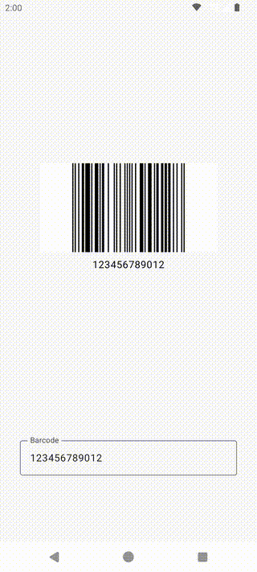

# barcode_example_android

This is a sample application built with Android Jetpack Compose that generates and displays an EAN13 barcode when a 12-digit or 13-digit number is entered.

## Features

- **EAN13 Barcode Generation**
  Automatically generates an EAN13 barcode when a 12-digit or 13-digit number is entered.

- **Real-time Updates**
  The barcode updates immediately whenever the number in the input field is changed.

## Used Libraries

This app uses the [zxing-cpp](https://github.com/zxing-cpp/zxing-cpp) library to generate barcodes.
zxing-cpp is a high-performance and versatile C++ library for barcode generation and decoding, supporting a wide range of barcode formats.

## Development Environment

- **Development Environment**: Android Studio Koala Feature Drop | 2024.1.2 Patch 1
- **Languages**: Kotlin, Jetpack Compose

## iOS example
https://github.com/h-nimrod/barcode_example_ios
